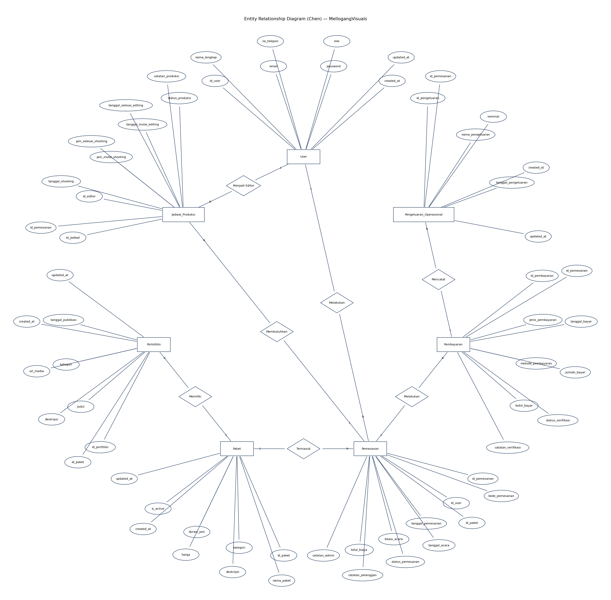
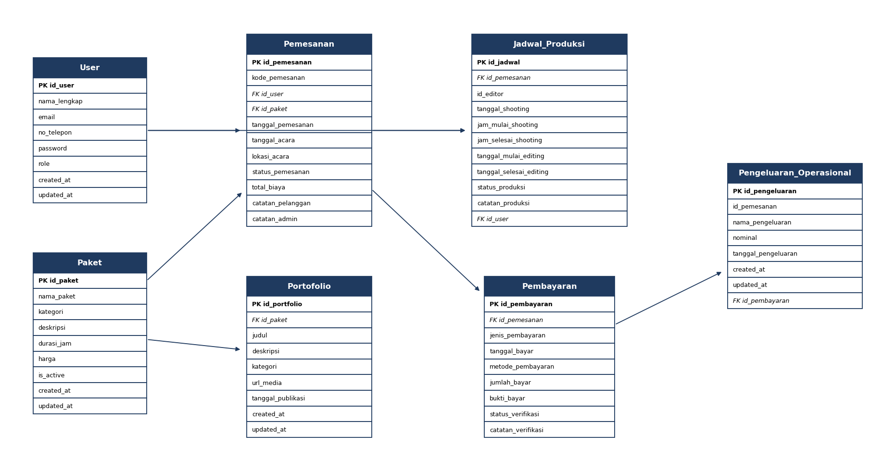
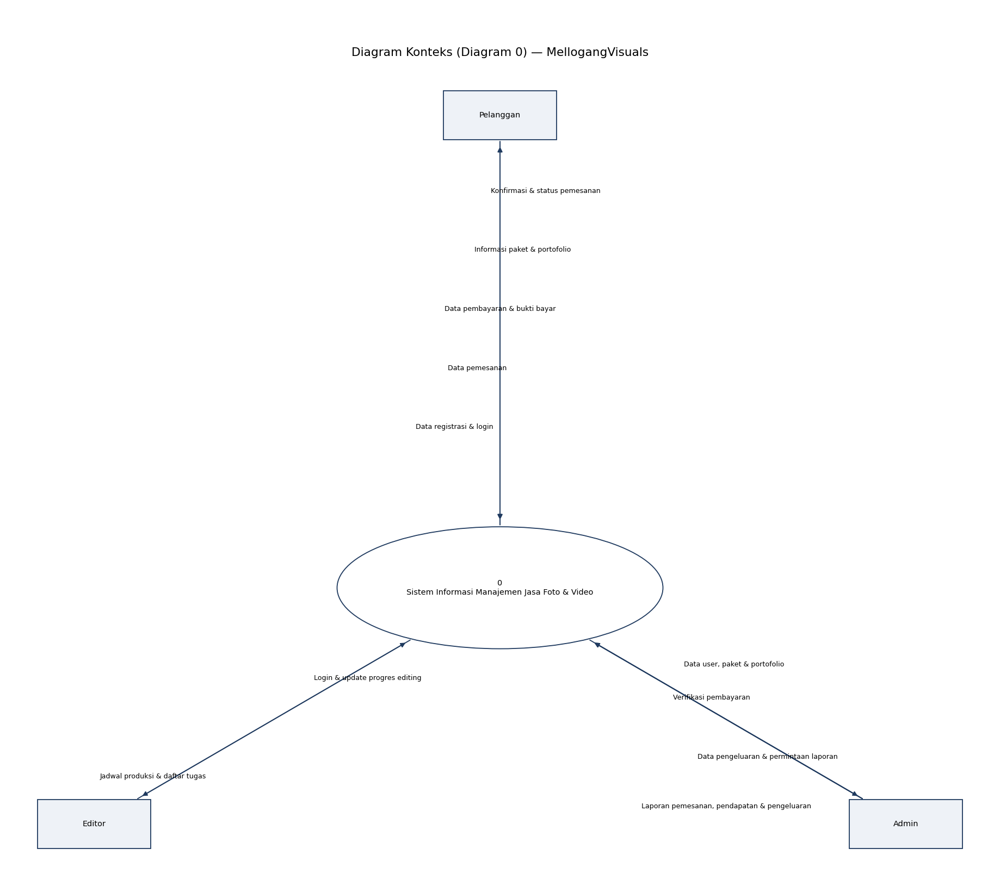
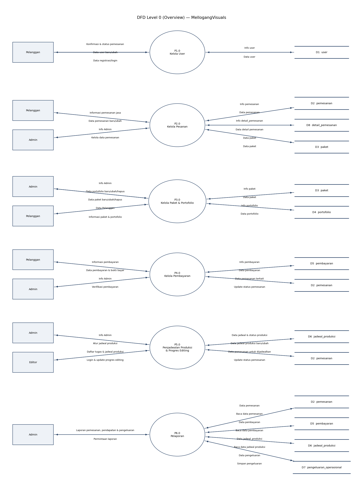
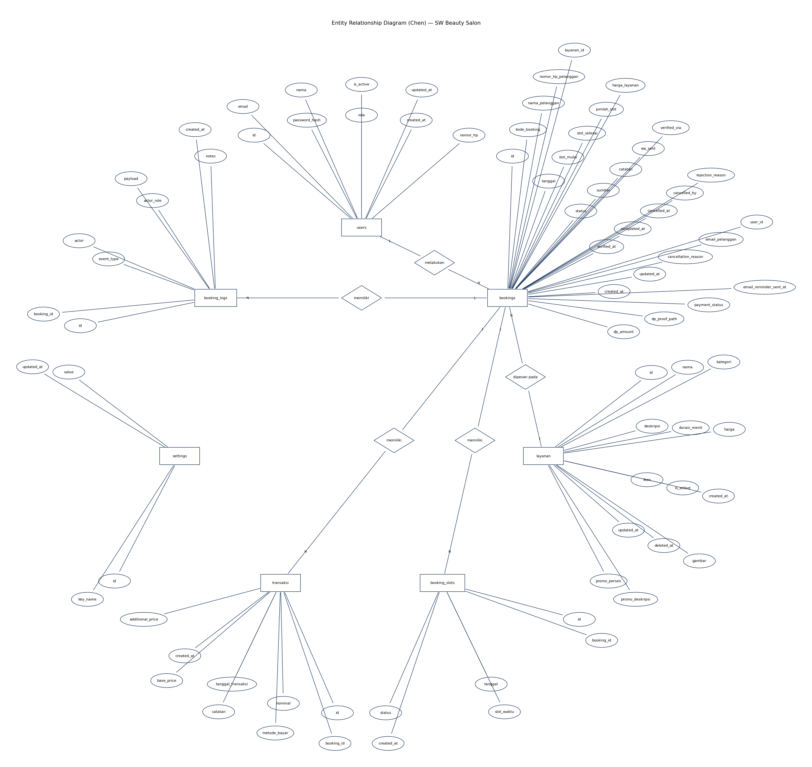
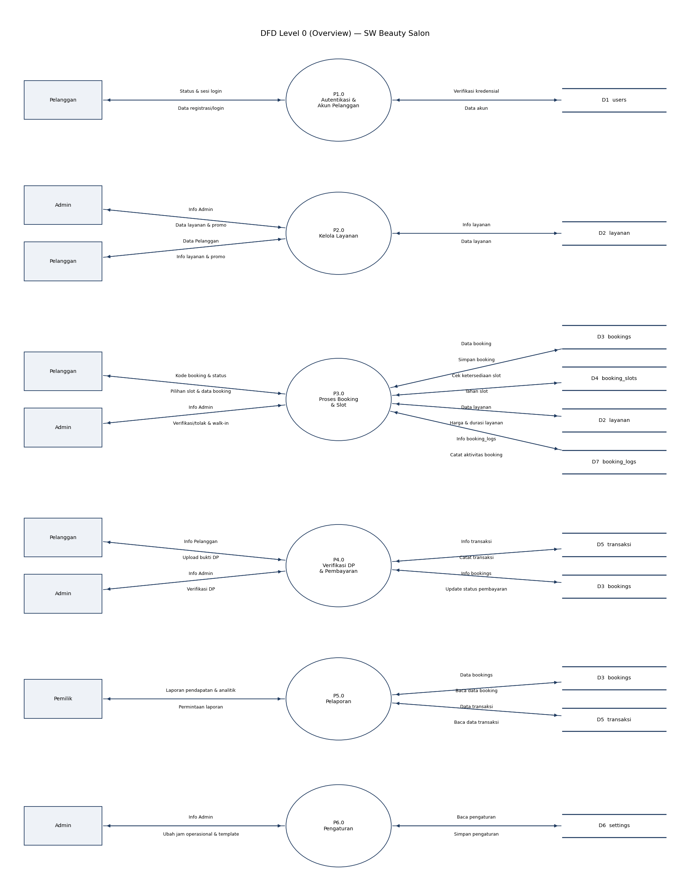

# Kenshi Diagrams

A deterministic **layout engine + CLI** that turns a database schema (or hand
data) into **clean, overlap‑free, fully‑editable DFD & ERD diagrams** — exported
as **draw.io `.drawio`** *and* **yEd / yWorks `.graphml`**.

Built for Indonesian academic (thesis BAB III/IV) diagrams. It ships finished
diagrams for two real CodeIgniter 4 apps:

| Project | Source of truth |
|---|---|
| **MellogangVisuals** (jasa foto & video) | schema imported from [`ryuken25/mellogangvisuals`](https://github.com/ryuken25/mellogangvisuals) |
| **SW Beauty Salon** | schema imported from [`ryuken25/beauty-salon`](https://github.com/ryuken25/beauty-salon) |

## What it guarantees

- **Zero overlap.** No label sits on another label or on a shape — verified by a
  metric (`make check` reports `0 / 0` for every diagram). This is the #1 rule.
- **Edges approach from any side** — top, bottom, left or right — not only
  left↔right. Connections are anchored to the *facing* side of each shape (and
  stay editable), so flows can come in from below.
- **DFD data goes both ways.** Every external entity, every process and every
  data store has **both an input and an output** flow (balanced automatically
  with the `Data …` / `Info …` convention).
- **Editable everywhere.** Open the `.drawio` in [app.diagrams.net](https://app.diagrams.net)
  or the `.graphml` in [yEd](https://www.yworks.com/products/yed) — real shapes,
  positions, labels, crow's‑foot ends and open‑rectangle data stores, all movable.

## Diagram types

ERD **Chen** (radial sunburst, attributes fanned, diamonds on chords, PK
underlined) · ERD **Crow's Foot** (proper tables: header band + PK/FK‑marked
rows, orthogonal FK edges) · DFD **Context (Diagram 0)** · DFD **Level 0** (per‑process
clusters, duplicated stores/externals marked) · DFD **Level 1** (P1…P6 decompositions).

## Gallery

ERD Chen | ERD Crow's Foot
:---:|:---:
 | 

DFD Context | DFD Level 0
:---:|:---:
 | 

Beauty‑salon ERD (from the imported CI4 schema) | Beauty‑salon DFD Level 0
:---:|:---:
 | 

> PNGs are previews. The real, editable deliverables are the `.drawio` / `.graphml`
> files in [`result/`](result/).

## Quick start

```bash
python -m kenshi.cli --out out      # MellogangVisuals -> out/*.drawio + *.graphml
python -m kenshi.cli --check        # overlap metrics (acceptance: 0 / 0)
make results                        # result/with/ and result/without/ (both projects)
make gallery                        # re-render docs/img/*.png
```

The engine core (`kenshi/`) is **pure standard library** — no install needed.
Only the optional PNG preview uses `matplotlib` (`pip install -r requirements.txt`).

## `result/` — with vs without the model

```
result/without/   layouts from the deterministic engine only (no ML)
result/with/      ERD ring order chosen by the offline distilled model
```

Both are overlap‑free; the comparison shows the offline model reproduces the
engine's ordering decision. On the small real ERDs the deterministic engine is
already optimal, so `without/` is the recommended default and `with/` is the
offline approximation.

## How it works

```
schema / hand data ─▶ neutral model ─▶ layout engine ─▶ exporters ─▶ .drawio / .graphml
                       (kenshi/model)   (kenshi/layout)   (kenshi/export)
```

- `kenshi/importers/ci4.py` — replays CodeIgniter 4 migrations (createTable /
  addColumn / dropColumn / addForeignKey / raw `ALTER TABLE`) to reconstruct the
  final schema, then maps it to entities/attributes/relationships.
- `kenshi/layout/` — the tidiness engine: `chen`, `crowsfoot`, `context`, `dfd`
  (Level 0/1 per‑process clusters). All overlap‑avoidance lives here
  (`geometry.py`: boundary clipping, label de‑collision, node spreading).
- `kenshi/export/` — `drawio.py` (mxGraphModel, partial‑border data stores,
  edges under shapes) and `graphml.py` (yEd `y:ShapeNode` / `y:PolyLineEdge`).

## The offline "AI tidy" model (`ai/`)

Honest design (per the project brief): **clean layout comes from the
deterministic engine, not ML.** The model only powers an *offline* tidy mode and
is trained by **knowledge distillation on synthetic data** — thousands of random
graphs laid out by the engine (the teacher). The real reference diagrams are the
**gold eval set, never the training set** (10 samples can't train a layout model).

- Task: imitate the engine's ERD ring‑ordering decision (minimise chord
  crossings). A compact GNN (Laplacian‑eigenvector features) predicts a ring
  configuration; decoding = sort by angle.
- `ai/data_gen.py` → `ai/train.py` (GPU autodetect, early stopping) → `ai/eval.py`
  → `ai/export_onnx.py`. Run end‑to‑end with `make train && make eval && make onnx`.

**Latest eval** (`ai/artifacts/metrics.json`):

| metric | value |
|---|---|
| test mean crossing‑gap vs engine | **+6.0** (random ≈ +30) |
| reproduces engine's optimum exactly | **35.6 %** (within‑1: 48.4 %) |
| MellogangVisuals ERD overlaps | **0 label / 0 shape** |

> **The trained model and dataset are intentionally NOT committed** (`.gitignore`
> excludes `ai/artifacts/*` except `metrics.json`). Regenerate with `make train`.
> If the model is absent, the engine path is used automatically — identical clean
> output.

## Layout / structure

```
kenshi/
  model.py            neutral Diagram / Node / Edge
  geometry.py         boundary clipping, label de-collision, spreading
  metrics.py          overlap + crossing metrics
  preview.py          matplotlib preview renderer
  importers/ci4.py    CodeIgniter 4 migration importer
  layout/             chen, crowsfoot, context, dfd (the engine)
  export/             drawio, graphml
  content/            mellogang, beauty_salon, generic builders
  ai/runtime.py       offline ONNX ordering predictor (graceful fallback)
ai/                   training subproject (model NOT committed)
scripts/              generate_results.py, make_gallery.py
result/               with/ + without/ — the editable deliverables
docs/img/             preview gallery
```
